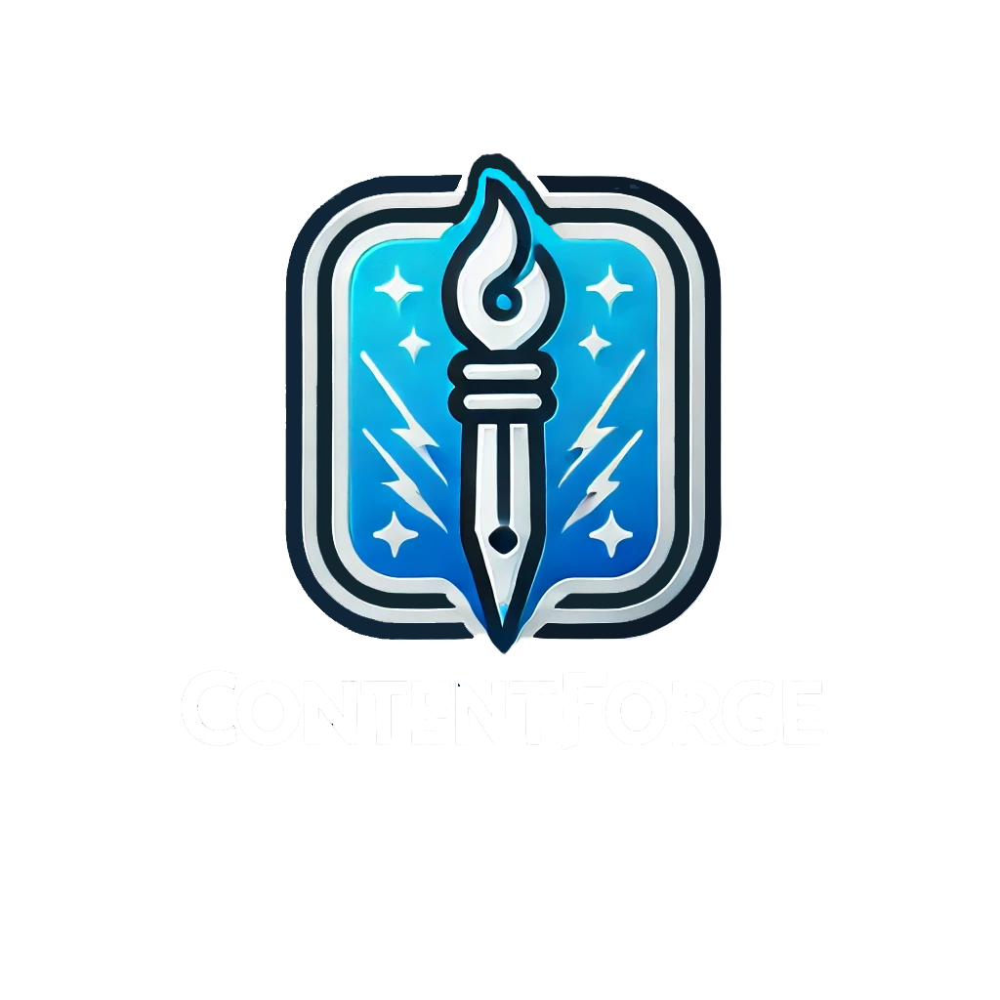

# ContentForge
  
  

## ⭐Description
The ContentForge framework is designed for developing plugins and tools tailored for digital content creation (DCC) software.

This framework comprises a set of utilities and tools that facilitate the creation and management of extended functionalities or 
plugins for DCC applications.

It is specifically designed to support Autodesk Maya, Autodesk 3ds Max, Adobe Substance Painter, and Adobe Substance Designer.

Written in Python, the framework leverages the Python APIs provided by these supported applications, 
ensuring seamless integration and enhanced productivity.

## Core Features
- **Cross-Platform Development Toolchain** - Unified workflow for DCC software development 
- **Production-Ready Pipeline Templates** - Pre-configured toolkits for asset management workflows  
- **Version-Tolerant Abstraction Layer** - Backwards compatibility bridge for DCC tools
- **CI/CD-Ready Deployment Pipeline** - Automated build/test/release workflow integration  

## Technical Highlights
- **API Unification** - Common interface patterns for 3D/Design software  
- **Packaging Guarantee** - Full PEP-420 compliant distribution support  
- **Runtime Validation** - Auto-handling of DCC version divergence  
- **Performance Layer** - Asynchronous task execution framework 

## 📋 Build Status
| Platform   | Status                                                                 |
|------------|------------------------------------------------------------------------|
| Windows    |     |
| Mono/Linux |  |
| iOS/Mac    |  |

| Branch      | Status                                                                      |
|-------------|-----------------------------------------------------------------------------|
| main        |      |
| release     |            |
| stable      |            |
| preview     |      |
| development |      |

| DCC Application          | support version                                                      | Status                                                            |
|--------------------------|----------------------------------------------------------------------|-------------------------------------------------------------------|
| Autodesk Maya            |     |    |
| Autodesk 3ds Max         |     |    |
| ZBrush                   |      |    |
| Photoshop                |   |  |
| Adobe Substance painter  |     |  |
| Adobe Substance Designer |     |  |
| Blender                  |      |    |
| Houdini                  |      |    |
| Marmoset Toolbag         |      |    |
| Unity                    |      |  |
| Unreal Engine 4          |      |    |
| Unreal Engine 5          |      |  |

## ⭐Features:

## 🚀 Quick Started

## 🛠️ Installation

## 📦 Requirements

## 📖 Documentation
- [Document](docs/index.md)
- [Version History](docs/version/changelog.md)
- [Usage Guide](docs/guide/quickstart.md)

## ❓ FAQ
Please visit the [FAQ](docs/guide/faq.md) page for more information.

## 📜 License
This project is licensed under the MIT License - see the [LICENSE](LICENSE) file for details.

## 📧 Contact
 
  
 

