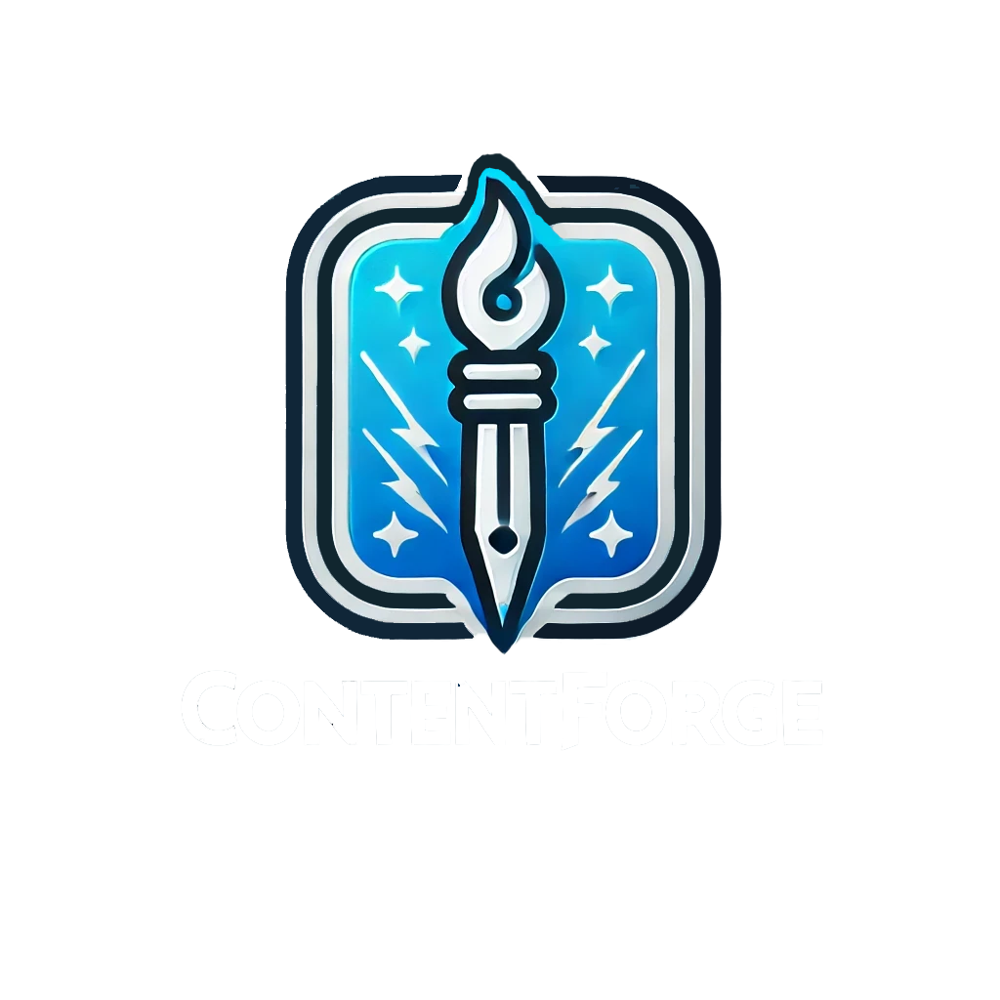

# ContentForge
    

## ⭐Description
The ContentForge framework is designed for developing plugins and tools tailored for digital content creation (DCC) software.

This framework comprises a set of utilities and tools that facilitate the creation and management of extended functionalities or 
plugins for DCC applications.

It is specifically designed to support Autodesk Maya, Autodesk 3ds Max, Adobe Substance Painter, and Adobe Substance Designer.

Written in Python, the framework leverages the Python APIs provided by these supported applications, 
ensuring seamless integration and enhanced productivity.

## 📋 Build Status
| Platform   | Status                                                                 |
|------------|------------------------------------------------------------------------|
| Windows    |     |
| Mono/Linux |  |
| iOS/Mac    |  |

| Branch      | Status                                                                  |
|-------------|-------------------------------------------------------------------------|
| main        |  |
| release     |        |
| stable      |        |
| preview     |        |
| development |    |

## ⭐Features:

## 🚀 Quick Started

## 🛠️ Installation

## 📦 Requirements

## 📖 Documentation
- [Version History](docs/version_history.md)
- [Usage Guide](docs/usage_guide/usage_guide.md)
- [Deps Guide](docs/deps_guide/deps_guide.md)
- [Developer Guide](docs/dev_guide/dev_guide.md)

## ❓ FAQ
Please visit the [FAQ](docs/usage_guide/FAQ.md) page for more information.

## 📜 License
This project is licensed under the MIT License - see the [LICENSE](LICENSE) file for details.

## 📧 Contact
    

